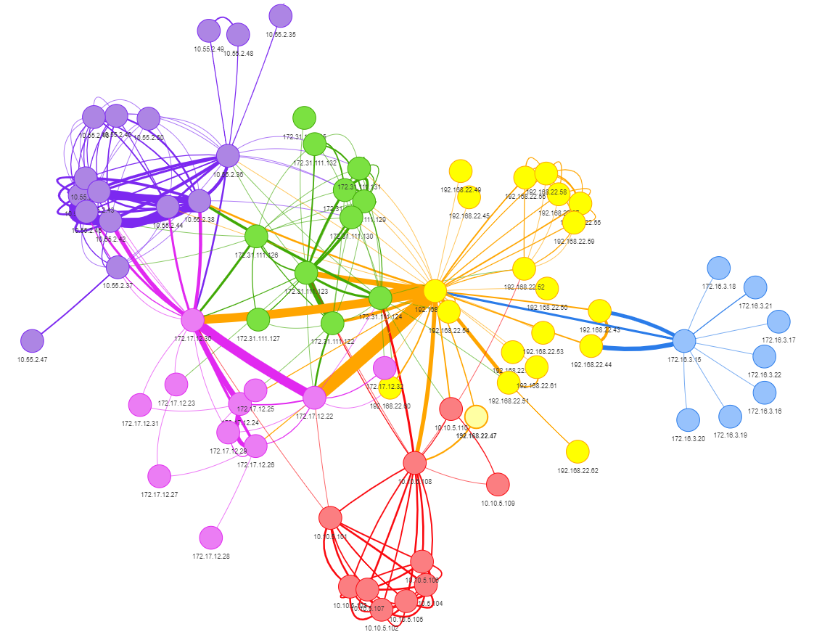

# visNetwork for Network Data
visNetwork, an R package for interactive network visualization, utilized to visualize a hypothetical Emotet malware outbreak on an IPv4 network.  
Refer to [DFIR Redefined Part 3: visNetwork for Network Data](https://holisticinfosec.io/post/visnetwork) for more details.

